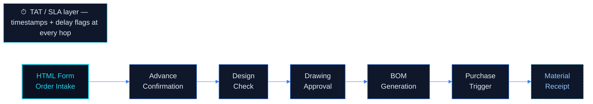
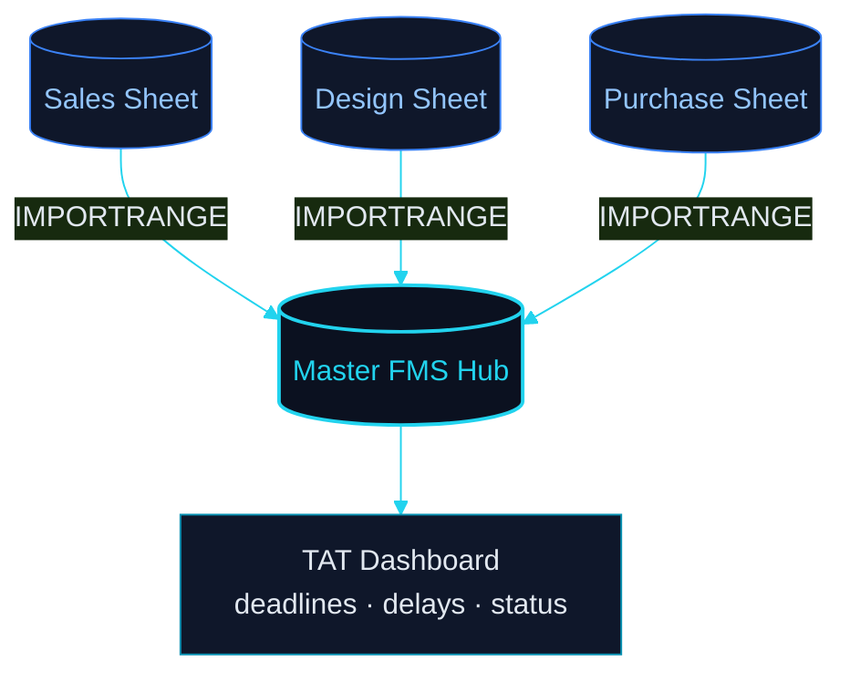
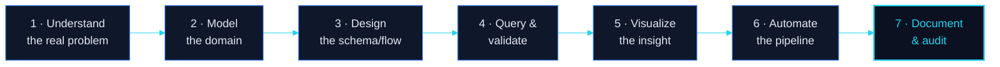

<!--
=====================================================================================
  ABHISHEK KUMAR — GITHUB PROFILE README
  Brand system: "Cyan / Blue Enterprise" · Dark theme
  Palette tokens
    base    #0B1120     surface #0F172A     border  #1E293B
    cyan    #22D3EE     cyanDp  #06B6D4      blue    #3B82F6     blueDp  #2563EB
    text    #E2E8F0     muted   #94A3B8
  NOTE: GitHub sanitizes <style>, <script>, class= and inline style=. The premium
  look here comes from externally-rendered animated SVGs + GitHub-safe HTML tables.
  All content aligned to CV (Abhishek-Kumar-CV.pdf). Repo: github.com/abhishek8762a/abhishek8762a
=====================================================================================
-->

<!-- ============================== HERO BANNER ============================== -->

<a href="https://github.com/abhishek8762a">
  
</a>

<!-- ============================== TYPING SUBLINE ============================== -->

<div align="center">

<a href="https://github.com/abhishek8762a">
  
</a>

<br/>

<!-- Identity chips -->

&nbsp;

&nbsp;
<a href="https://github.com/abhishek8762a?tab=followers">
  
</a>
&nbsp;


</div>

<br/>

<!-- ============================== ELEVATOR PITCH ============================== -->

<div align="center">

### `Turning operational chaos into clean, queryable, decision-ready data.`

I'm a **Data Analyst** who builds the systems operations actually run on. Right now I manage a **live,
multi-department Flow Management System** that replaced manual verbal workflows with **TAT-tracked digital
pipelines** across Sales, Design &amp; Purchase. Before analytics, I spent real time in a **GMP/GLP Quality
Control lab** — HPLC, batch records, regulatory data integrity — which gives me a rare edge: I read data
the way a pharma auditor does. My goal is to become a **world-class Data Analyst** across **Business
Intelligence, Pharma / Life-Sciences Analytics, Automation &amp; System Design.**

</div>

<br/>

<!-- ============================== CTA BUTTONS ============================== -->

<div align="center">

<a href="mailto:abhiyadav8762@gmail.com">
  
</a>
<a href="https://linkedin.com/in/abhishek-kumar">
  
</a>
<a href="https://github.com/abhishek8762a?tab=repositories">
  
</a>
<a href="https://github.com/abhishek8762a/abhishek8762a/blob/main/Abhishek-Kumar-CV.pdf">
  
</a>

</div>

<br/>

<!-- ============================== HERO STATS PREVIEW (reliable services only) ============================== -->

<div align="center">


</div>

<!-- ============================== SECTION DIVIDER ============================== -->


<br/>

<!-- ============================== ABOUT / STORY ============================== -->

<div align="center">

##  &nbsp; The Story — *Pharma QC → Data Analytics*

</div>

<table>
<tr>
<td width="60%" valign="top">

I don't come from a computer-science background. I come from the **QC lab and the shop floor** — where a
wrong number isn't a failed unit test, it's a **rejected batch**. In a **GMP/GLP** environment I ran
**HPLC, Karl Fischer, UV-Vis and TLC** analyses and maintained QC records for **200+ batch tests**, where
every value needed full traceability and audit-readiness. That habit defines how I build software today:
**data must be correct, traceable, and defensible.**

Every system I design starts with the question a QC analyst asks:
> *"If someone audits this in six months, does it still hold up?"*

So I learned **SQL** to stop exporting spreadsheets, **Power BI** to stop emailing static reports, and
**Google Apps Script** to stop doing the same manual task twice. Today I run a **production Flow
Management System** that digitized a fully manual, verbal order-to-dispatch process — and I'm extending it
into full material-lifecycle tracking.

I'm now driving toward one goal: to be a **Data Analyst who thinks like an engineer** — model the domain,
design the schema, write the query, build the dashboard, *and* automate the pipeline that keeps it alive.

</td>
<td width="40%" valign="top">

<br/>

```yaml
profile:
  name:       Abhishek Kumar
  title:      Data Analyst
  role:       MIS Data Analyst
  company:    Dharma Power Transmission
  location:   Lucknow, India
  origin:     Pharma Quality Control (GMP/GLP)
  education:  B.Sc. — Chemistry, Zoology, Botany
  goal:       World-Class Data Analyst

domain_edge:
  - GMP / GLP data integrity
  - HPLC · Karl Fischer · UV-Vis · TLC
  - Batch records & audit-readiness

focus:
  - SQL & Data Modeling
  - Power BI & Business Intelligence
  - MIS Automation (Apps Script)
  - Manufacturing & Pharma Analytics

operating_mode: |
  Measure first.
  Model the domain.
  Automate the boring.
  Make it auditable.
```

</td>
</tr>
</table>

<br/>

<!-- ============================== CAREER TIMELINE ============================== -->

<div align="center">

### The Transition — one continuous line, not a career change

```mermaid
%%{init: {'theme':'base','themeVariables':{'primaryColor':'#0F172A','primaryTextColor':'#E2E8F0','primaryBorderColor':'#22D3EE','lineColor':'#3B82F6','fontFamily':'Fira Code'}}}%%
flowchart LR
    A([Pharma QC<br/>GMP/GLP Lab]):::a --> B([MIS / Operations]):::b
    B --> C([Automation<br/>Apps Script]):::c
    C --> D([SQL]):::d
    D --> E([Power BI]):::e
    E --> F([System Design<br/>FMS]):::f
    F --> G([Business Intelligence]):::g
    G --> H{{Data Analyst}}:::h

    classDef a fill:#0F172A,stroke:#334155,color:#94A3B8;
    classDef b fill:#0F172A,stroke:#0891B2,color:#CBD5E1;
    classDef c fill:#0F172A,stroke:#0AB5D4,color:#CBD5E1;
    classDef d fill:#0F172A,stroke:#22D3EE,color:#E2E8F0;
    classDef e fill:#0F172A,stroke:#38BDF8,color:#E2E8F0;
    classDef f fill:#0F172A,stroke:#3B82F6,color:#E2E8F0;
    classDef g fill:#0F172A,stroke:#2563EB,color:#E2E8F0;
    classDef h fill:#0B1120,stroke:#22D3EE,color:#22D3EE,stroke-width:2px;
```

</div>

<div align="center">



</div>

<br/>


<br/>

<!-- ============================== WORK EXPERIENCE ============================== -->

<div align="center">

##  &nbsp; Experience

</div>

<table>
<tr>
<td width="4" valign="top"></td>
<td valign="top">

**MIS Data Analyst** &nbsp;·&nbsp; **Dharma Power Transmission Pvt Ltd** &nbsp;·&nbsp; <sub>Feb 2026 – Present</sub>

- Designed &amp; deployed a **multi-department Flow Management System (FMS)** on Google Sheets — digitizing a fully manual, verbal order-to-dispatch workflow across **Sales, Design &amp; Purchase**.
- Engineered **conditional workflow routing**: HTML form → advance confirmation → design check → drawing approval → BOM generation → purchase trigger — eliminating all verbal inter-department handoffs.
- Built a **real-time cross-department data pipeline** via `IMPORTRANGE` and implemented **TAT-based SLA tracking** — deadline visibility and delay flagging at every workflow stage.
- **Now extending** the FMS to a **Purchase-to-Material-Receipt** module — completing end-to-end order lifecycle tracking from inquiry to goods received.

</td>
</tr>
<tr>
<td width="4" valign="top"></td>
<td valign="top">

**Quality Control Executive** &nbsp;·&nbsp; **Mahima Life Science Pvt. Ltd., Sonipat** &nbsp;·&nbsp; <sub>Sept 2025 – Feb 2026</sub>

- Maintained **GMP/GLP-compliant QC data records** for **200+ batch tests** in MS Excel — ensuring full traceability, documentation integrity and audit-readiness.
- Executed **HPLC (Lab Solutions), Karl Fischer, UV-Vis and TLC** analyses per SOP — generating structured analytical reports for raw-material and finished-product compliance.
- Hands-on with **batch release criteria, instrument calibration logs and regulated pharma data** — directly transferable to pharma analytics roles.

</td>
</tr>
</table>

<br/>


<br/>

<!-- ============================== FEATURED PROJECTS ============================== -->

<div align="center">

##  &nbsp; Featured Work — *real systems, real findings*

<sub>Every project below is live in production or public on GitHub — presented as a product page.</sub>

<br/>


</div>

<br/>

<!-- ---------------------------------------------------------------------------- -->
<!-- PROJECT 01 — FLOW MANAGEMENT SYSTEM (FLAGSHIP · PRODUCTION)                   -->
<!-- ---------------------------------------------------------------------------- -->

<table>
<tr>
<td>

<div align="center">

### ★ &nbsp; Flow Management System (FMS) &nbsp; ★
**`FLAGSHIP`** &nbsp;·&nbsp; **`● LIVE IN PRODUCTION`** &nbsp;·&nbsp; Multi-Department Order-to-Dispatch Engine


</div>

> **One-line pitch:** A production system that replaced a fully **manual, verbal** order-to-dispatch process
> with a **TAT-tracked digital pipeline** — routing every order through Sales, Design and Purchase with
> deadline visibility and delay flagging at each stage.

</td>
</tr>
</table>

<table>
<tr>
<td width="50%" valign="top">

**◆ Business Problem**

Orders moved between Sales, Design and Purchase by **word of mouth**. Nothing was timestamped, nobody owned
the deadline, and delays were invisible until a customer complained. There was no single view of where an
order actually was.

**◆ The Solution**

A Google-Sheets-native FMS where an order enters through an **HTML form** and is **conditionally routed**
stage-by-stage. Every hop is timestamped, every stage has a **TAT/SLA**, and cross-department data flows in
real time — turning an untraceable verbal chain into an **auditable pipeline.**

</td>
<td width="50%" valign="top">

**◆ Tech Used**


**◆ Core Capabilities**

- HTML-form order intake → structured records
- Conditional routing across Sales / Design / Purchase
- Real-time cross-sheet pipeline via `IMPORTRANGE`
- TAT-based SLA tracking with delay flagging
- Stage-level deadline visibility for every order
- Extensible to full material-lifecycle tracking

</td>
</tr>
</table>

<details>
<summary><b>◆ Workflow Architecture &nbsp;—&nbsp; click to expand</b></summary>

<br/>



**Design principle:** the workflow is **conditional, not linear** — an order only advances when the stage's
gate is satisfied (advance confirmed, drawing approved, etc.), so the pipeline enforces the process instead
of trusting people to remember it.

</details>

<details>
<summary><b>◆ Data Flow &amp; Cross-Department Model &nbsp;—&nbsp; click to expand</b></summary>

<br/>



**Learning:** `IMPORTRANGE` turns separate department sheets into one **live** source of truth without a
database — the right level of engineering for the team's tools, while keeping a clean upgrade path to SQL.

**Future Scope:** Purchase-to-Material-Receipt module (in progress), supplier TAT scoring, and a migration
path from Sheets to a relational backend as volume grows.

</details>

<div align="center">

<a href="#">
  
</a>
<a href="https://github.com/abhishek8762a/task-delegation-tracker">
  
</a>

<sub>The FMS itself is internal company software; the delegation-tracker repo below is a public Apps-Script system built in the same style.</sub>

</div>

<br/>


<br/>

<!-- ---------------------------------------------------------------------------- -->
<!-- PROJECT 02 — FDA ADVERSE EVENTS (SQL · PHARMACOVIGILANCE)                     -->
<!-- ---------------------------------------------------------------------------- -->

<div align="center">

### FDA Adverse Events Analysis — SQL &amp; Pharmacovigilance
**`● PUBLIC`** &nbsp;·&nbsp; 90,786 real FDA CAERS records (2004–2017)


</div>

<table>
<tr>
<td width="50%" valign="top">

**◆ Business Problem**

Regulators and safety teams sit on huge adverse-event datasets that answer nothing until someone asks the
right questions. Which product categories drive the most reports? Who is most at risk? Where are the serious
outcomes concentrated?

**◆ The Solution**

Full ingestion, cleaning and **multi-angle pharmacovigilance investigation** of the FDA CAERS dataset using
advanced SQL — surfacing actionable safety signals a team could act on.

</td>
<td width="50%" valign="top">

**◆ Tech Used**


**◆ Key Findings**

- **Supplements:** 48,501 reports — **4× vs Cosmetics**
- Reports **grew 5×** (2004 → 2016)
- **Females: 64.9%** of all reports
- **Seniors (60+):** highest serious-case count
- **1,393** death / hospitalization entries identified
- Cross-validated against the **Hydroxycut 2009 ban**

</td>
</tr>
</table>

<details>
<summary><b>◆ Sample SQL thinking &nbsp;—&nbsp; click to expand</b></summary>

<br/>

```sql
-- Serious outcomes by age group: where does risk concentrate?
SELECT
    age_group,
    COUNT(*)                                   AS total_reports,
    SUM(CASE WHEN outcome IN ('Death','Hospitalization')
             THEN 1 ELSE 0 END)                AS serious_cases,
    ROUND(100.0 * SUM(CASE WHEN outcome IN ('Death','Hospitalization')
             THEN 1 ELSE 0 END) / COUNT(*), 1) AS serious_pct
FROM caers_events
GROUP BY age_group
ORDER BY serious_cases DESC;
```

The question isn't "how many reports" — it's "**where do the *serious* ones cluster**." That framing is
what turned 90k rows into a safety signal.

</details>

<div align="center">

<a href="https://github.com/abhishek8762a/fda-adverse-events-sql">
  
</a>

</div>

<br/>


<br/>

<!-- ---------------------------------------------------------------------------- -->
<!-- PROJECT 03 — NETFLIX ANALYTICS (POWER BI + SQL)                               -->
<!-- ---------------------------------------------------------------------------- -->

<div align="center">

### Netflix Analytics Dashboard — Power BI + SQL
**`● PUBLIC`** &nbsp;·&nbsp; End-to-End: SQL Analysis → Interactive Power BI


</div>

<table>
<tr>
<td width="50%" valign="top">

**◆ Business Problem**

A raw catalogue of thousands of titles answers nothing on its own. What's the content mix? How has the
library shifted over time? What story does the catalogue tell?

**◆ The Solution**

A two-part build: a **SQL analysis layer** that answers business questions against the catalogue, and a
**fully interactive Power BI dashboard** — dynamic slicers, drill-through filters and KPI cards — modelled
end-to-end in Power Query (M).

</td>
<td width="50%" valign="top">

**◆ Tech Used**


**◆ Key Findings**

- **Movies: 69%** of the catalogue
- Content **surged 300%+ post-2015**
- Interactive slicers + drill-through + KPI cards
- Cleaned &amp; modelled end-to-end in Power Query (M)

</td>
</tr>
</table>

<div align="center">

<a href="https://github.com/abhishek8762a/netflix-sql-project">
  
</a>
<a href="https://github.com/abhishek8762a/netflix-data-analysis-PowerBI">
  
</a>

</div>

<br/>


<br/>

<!-- ---------------------------------------------------------------------------- -->
<!-- PROJECT 04 — TASK DELEGATION TRACKER (APPS SCRIPT)                            -->
<!-- ---------------------------------------------------------------------------- -->

<div align="center">

### Delegation Management System — Apps Script Web App
**`● PUBLIC`** &nbsp;·&nbsp; Task assignment, follow-ups &amp; MD-level dashboards


</div>

<table>
<tr>
<td width="50%" valign="top">

**◆ Business Problem**

Delegated tasks fall through the cracks: no owner, no follow-up, no visibility for leadership on what's
actually getting done.

**◆ The Solution**

A Google Apps Script web app for **task assignment, follow-up tracking and revision management**, topped
with **MD-level performance dashboards** so leadership sees delegation health at a glance.

</td>
<td width="50%" valign="top">

**◆ Tech Used**


**◆ Features**

- Task assignment &amp; ownership
- Follow-up &amp; revision tracking
- MD-level performance dashboards
- Sheet-driven — reconfigure without redeploy

</td>
</tr>
</table>

<div align="center">

<a href="https://github.com/abhishek8762a/task-delegation-tracker">
  
</a>

</div>

<br/>

<!-- ---------------------------------------------------------------------------- -->
<!-- LIVE REPOSITORIES STRIP                                                       -->
<!-- ---------------------------------------------------------------------------- -->

<div align="center">

### ● All Public Repositories

</div>

<table>
<tr>
<th align="left">Repository</th>
<th align="left">What it is</th>
<th align="left">Stack</th>
<th align="center">Link</th>
</tr>
<tr>
<td valign="top"><b>fda-adverse-events-sql</b></td>
<td valign="top">Pharmacovigilance analysis over <b>90,786</b> FDA CAERS records.</td>
<td valign="top"><code>SQL</code></td>
<td align="center"><a href="https://github.com/abhishek8762a/fda-adverse-events-sql">Open ↗</a></td>
</tr>
<tr>
<td valign="top"><b>netflix-sql-project</b></td>
<td valign="top">Netflix catalogue analysis answering business questions in pure SQL.</td>
<td valign="top"><code>SQL</code></td>
<td align="center"><a href="https://github.com/abhishek8762a/netflix-sql-project">Open ↗</a></td>
</tr>
<tr>
<td valign="top"><b>netflix-data-analysis-PowerBI</b></td>
<td valign="top">Interactive Netflix dashboard built in Power BI.</td>
<td valign="top"><code>Power BI</code> <code>DAX</code></td>
<td align="center"><a href="https://github.com/abhishek8762a/netflix-data-analysis-PowerBI">Open ↗</a></td>
</tr>
<tr>
<td valign="top"><b>task-delegation-tracker</b></td>
<td valign="top">Apps Script web app — assignment, follow-ups &amp; MD dashboards.</td>
<td valign="top"><code>Apps Script</code> <code>HTML</code></td>
<td align="center"><a href="https://github.com/abhishek8762a/task-delegation-tracker">Open ↗</a></td>
</tr>
</table>

<br/>


<br/>

<!-- ============================== SKILLS ============================== -->

<div align="center">

##  &nbsp; The Toolkit — *grouped, not scattered*

<sub>Skills organized the way I actually use them — with the specifics, not just logos.</sub>

</div>

<br/>

<table>
<tr>
<td width="50%" valign="top">

**◆ SQL**


<sub>ROW_NUMBER · RANK · aggregation · data cleaning</sub>

</td>
<td width="50%" valign="top">

**◆ Power BI**


<sub>drill-through · interactive reports</sub>

</td>
</tr>
<tr>
<td width="50%" valign="top">

**◆ Excel**


</td>
<td width="50%" valign="top">

**◆ Automation &amp; Cloud**


</td>
</tr>
<tr>
<td width="50%" valign="top">

**◆ Databases &amp; Tools**


</td>
<td width="50%" valign="top">

**◆ Domain &amp; Business**


</td>
</tr>
</table>

<div align="center">

**◆ Soft Skills** — the multipliers


</div>

<br/>


<br/>

<!-- ============================== GITHUB ANALYTICS ============================== -->

<div align="center">

##  &nbsp; GitHub Analytics

</div>

<div align="center">


&nbsp;


</div>

<div align="center">


</div>

<div align="center">


</div>

<details>
<summary><b>◆ Contribution Snake &nbsp;—&nbsp; one-time setup note</b></summary>

<br/>

<div align="center">

<!-- The snake requires a GitHub Action (Platane/snk) that renders an SVG on a schedule.
     Add .github/workflows/snake.yml to your abhishek8762a/abhishek8762a repo to populate it. -->


</div>

**To enable the snake:** add `.github/workflows/snake.yml` using the `Platane/snk` action, output to the
`output` branch, and reference the SVG above. It regenerates your contribution graph as an animated snake
on every push / schedule. *(Ask me and I'll generate the workflow file for you.)*

</details>

<div align="center">

<sub>ⓘ If a stats card ever shows as a broken image, that's the shared public analytics service being
rate-limited — it loads on refresh. For guaranteed uptime you can self-host it free on Vercel (I can set
that up).</sub>

</div>

<br/>


<br/>

<!-- ============================== OPERATING SYSTEM (PRINCIPLES) ============================== -->

<div align="center">

##  &nbsp; My Operating System — *how I think before I build*

</div>

<table>
<tr>
<td width="50%" valign="top">

**◆ Engineering Principles**

- **The data model is the product.** Dashboards are disposable; the model is forever.
- **One source of truth.** Never sync copies — project from the original.
- **Auditable by default.** If you can't explain a number, you can't trust it.
- **Automate anything you've done twice.**
- **Boring on purpose.** Predictable systems beat clever ones.

**◆ Where the QC lab shows up**

Data integrity isn't a feature I add — it's the default I start from. Traceability, documentation and
audit-readiness are muscle memory from GMP/GLP.

</td>
<td width="50%" valign="top">

**◆ SQL Thinking**

> A query isn't code — it's a *question* asked precisely. If the answer surprises me, the data is telling
> me something the report never would.

**◆ System Thinking**

> Every operational pain is a modeling gap. "The spreadsheet broke" really means "the process was never
> modelled." Fix the model, the symptoms disappear.

**◆ Business Thinking**

> Nobody wants a dashboard. They want a decision made faster, with less risk. I build the decision, then
> wrap a dashboard around it.

</td>
</tr>
</table>

<details>
<summary><b>◆ My Problem-Solving Process &nbsp;—&nbsp; click to expand</b></summary>

<br/>



</details>

<br/>


<br/>

<!-- ============================== FOCUS & ROADMAP ============================== -->

<div align="center">

##  &nbsp; Current Focus &amp; Roadmap

</div>

<table>
<tr>
<td width="50%" valign="top">

**◆ Currently Focused On**

<br/>
<br/>
<br/>


**◆ Current Challenges**

- Turning a Sheets-based FMS into something that scales past Sheets.
- Designing a clean migration path from `IMPORTRANGE` to a relational backend.
- Keeping TAT/SLA logic simple for non-technical users.

</td>
<td width="50%" valign="top">

**◆ Learning Roadmap**

```text
NOW      ██████████░░  Advanced SQL · Power BI · DAX
NEXT     ██████░░░░░░  Python for data (pandas)
NEXT     █████░░░░░░░  Data warehousing concepts
LATER    ███░░░░░░░░░  ETL / ELT pipelines
LATER    ██░░░░░░░░░░  dbt · cloud data platforms
GOAL     ░░░░░░░░░░░░  Analytics Engineer
```

**◆ Future Goals**

- ▰ Become a world-class Data Analyst
- ▰ Specialize in Pharma / Life-Sciences analytics
- ▱ Grow into Analytics Engineering
- ▱ Ship systems real operations depend on

</td>
</tr>
</table>

<br/>


<br/>

<!-- ============================== WORKBENCH ============================== -->

<div align="center">

##  &nbsp; The Workbench

</div>

<table>
<tr>
<td width="34%" valign="top">

**◆ Daily Workflow**

1. Review what operations need today
2. Query first — let data frame the problem
3. Model / fix the flow if needed
4. Build or refine the dashboard
5. Automate the repetitive step
6. Document &amp; commit

</td>
<td width="33%" valign="top">

**◆ Dev Environment**

- Query — <code>MySQL Workbench</code>
- BI — <code>Power BI Desktop</code>
- Sheets — <code>Google Sheets</code>
- Automation — <code>Apps Script</code>
- Editor — <code>VS Code</code>
- VCS — <code>Git + GitHub</code>

</td>
<td width="33%" valign="top">

**◆ Favorite Tools**

- <code>SQL</code> — my primary language
- <code>Power BI</code> — for the story
- <code>Google Sheets</code> — rapid prototyping
- <code>Apps Script</code> — the glue
- <code>Mermaid</code> — thinking in diagrams

</td>
</tr>
</table>

<br/>


<br/>

<!-- ============================== EDUCATION · DOMAIN EDGE · WINS ============================== -->

<div align="center">

##  &nbsp; Education, Domain Edge &amp; Wins

</div>

<table>
<tr>
<td width="34%" valign="top">

**◆ Education**

- **B.Sc.** — Chemistry, Zoology &amp; Botany<br/><sub>Siddharth University · CGPA 7.68 · 2024</sub>
- **Class 12 (Science)** — 77%<br/><sub>Kendriya Vidyalaya, Lucknow Cantt · 2021</sub>
- **Class 10** — 82%<br/><sub>Kendriya Vidyalaya, Lucknow Cantt · 2019</sub>

</td>
<td width="33%" valign="top">

**◆ Pharma Domain Edge**

- GMP / GLP data environments
- HPLC (Lab Solutions), Karl Fischer
- UV-Vis &amp; TLC per SOP
- Batch release &amp; calibration logs
- Regulatory **data integrity**

<sub>A differentiator most analysts don't have.</sub>

</td>
<td width="33%" valign="top">

**◆ Achievements**

- ● Deployed a **live production FMS** end-to-end
- ● Analyzed **90,786** FDA records in SQL
- ● Maintained QC records for **200+ batch tests**
- ● Built **MD-level** performance dashboards
- ● Self-taught the full BI stack on the job

</td>
</tr>
</table>

<br/>


<br/>

<!-- ============================== CONNECT / FOOTER ============================== -->

<div align="center">

##  &nbsp; Let's Connect

<br/>

<a href="mailto:abhiyadav8762@gmail.com">
  
</a>
<a href="https://linkedin.com/in/abhishek-kumar">
  
</a>
<a href="https://github.com/abhishek8762a">
  
</a>

<br/><br/>


<br/>


<sub>Designed &amp; built by Abhishek Kumar · Cyan/Blue Enterprise theme · Lucknow, India</sub>

</div>
