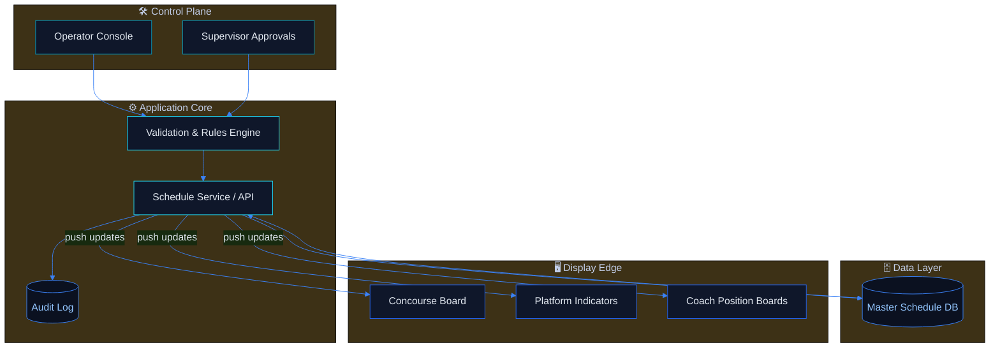
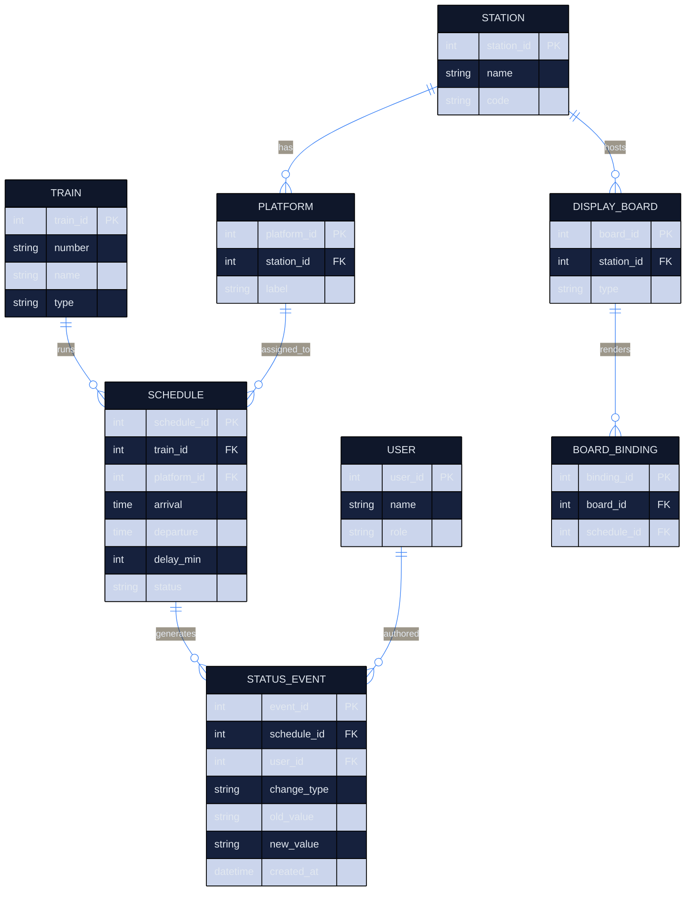
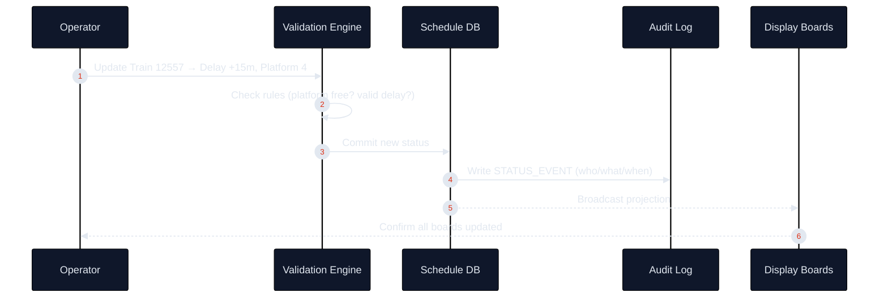
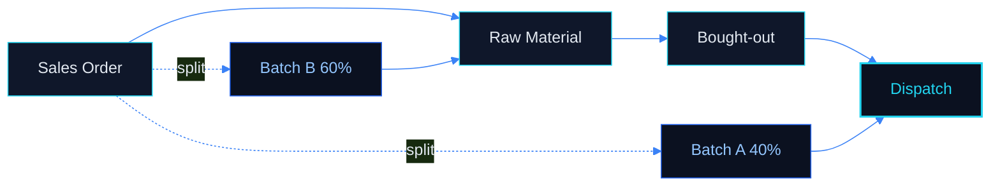
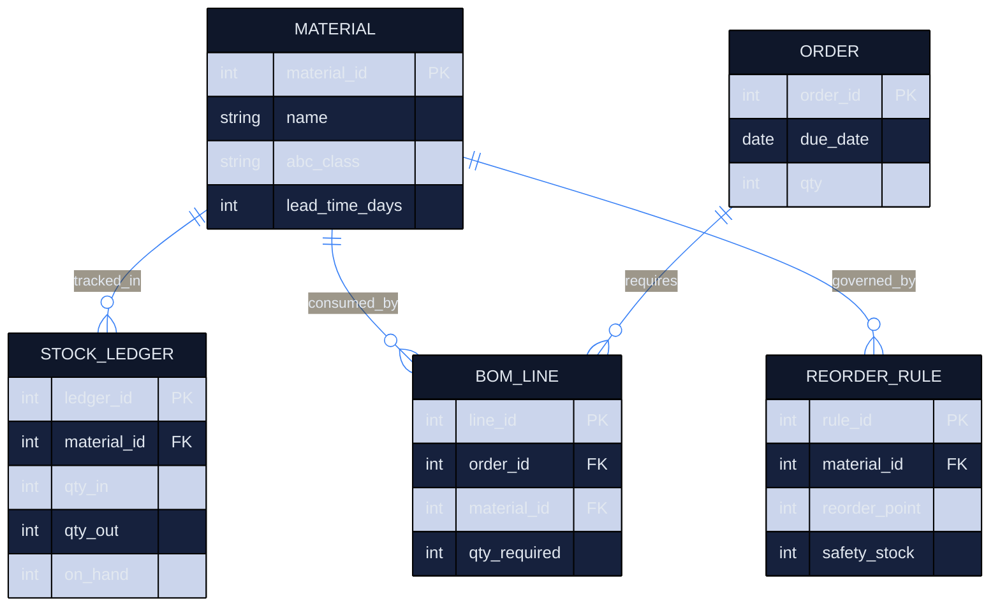
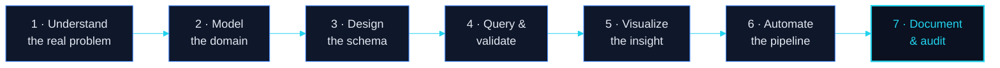

<!--
=====================================================================================
  ABHISHEK KUMAR — GITHUB PROFILE README
  Brand system: "Cyan / Blue Enterprise" · Dark theme
  Palette tokens
    base    #0B1120     surface #0F172A     border  #1E293B
    cyan    #22D3EE     cyanDp  #06B6D4      blue    #3B82F6     blueDp  #2563EB
    text    #E2E8F0     muted   #94A3B8
  NOTE: GitHub sanitizes <style>, <script>, class= and inline style=. The premium
  look here comes from externally-rendered animated SVGs + GitHub-safe HTML tables.
  Repo lives at:  github.com/abhishek8762a/abhishek8762a   (special profile repo)
=====================================================================================
-->

<!-- ============================== HERO BANNER ============================== -->

<a href="https://github.com/abhishek8762a">
  
</a>

<!-- ============================== TYPING SUBLINE ============================== -->

<div align="center">

<a href="https://github.com/abhishek8762a">
  
</a>

<br/>

<!-- Identity chips -->

&nbsp;

&nbsp;
<a href="https://github.com/abhishek8762a?tab=followers">
  
</a>
&nbsp;


</div>

<br/>

<!-- ============================== ELEVATOR PITCH ============================== -->

<div align="center">

### `Turning operational chaos into clean, queryable, decision-ready data.`

I'm a **manufacturing-floor analyst** who learned to code the systems the floor actually needs.
I started in **Pharma Quality Control**, moved into **manufacturing operations**, and now I build
**SQL pipelines, Power BI intelligence, and Apps-Script automations** that replace spreadsheets and
guesswork with **auditable systems**. My north star: become a **world-class Data Analyst** working at
the intersection of **Business Intelligence, Manufacturing Analytics, Automation, and System Design.**

</div>

<br/>

<!-- ============================== CTA BUTTONS ============================== -->

<div align="center">

<a href="mailto:abhiyadav8762@gmail.com">
  
</a>
<a href="https://www.linkedin.com/in/your-linkedin-handle">
  
</a>
<a href="https://github.com/abhishek8762a?tab=repositories">
  
</a>
<a href="https://github.com/abhishek8762a">
  
</a>

<sub><i>LinkedIn &amp; Resume links are placeholders — swap in your real URLs.</i></sub>

</div>

<br/>

<!-- ============================== HERO STATS PREVIEW ============================== -->

<div align="center">

<table>
<tr>
<td width="50%" valign="top">


</td>
<td width="50%" valign="top">


</td>
</tr>
</table>

</div>

<!-- ============================== SECTION DIVIDER ============================== -->


<br/>

<!-- ============================== ABOUT / STORY ============================== -->

<div align="center">

##  &nbsp; The Story — *Pharma QC → Data Engineering*

</div>

<table>
<tr>
<td width="60%" valign="top">

I don't come from a computer-science background. I come from the **shop floor and the QC lab** — where
a wrong number isn't a failed unit test, it's a **rejected batch**. That environment taught me the habit
that defines how I build software today: **data must be correct, traceable, and defensible.**

Every system I design starts with the same question a QC analyst asks:
> *"If someone audits this in six months, does it still hold up?"*

So I learned **SQL** to stop exporting spreadsheets. I learned **Power BI** to stop emailing static
reports. I learned **Apps Script &amp; automation** to stop doing the same manual task twice. And I learned
**system design** because a report is only as good as the data model beneath it.

I'm now driving toward a single goal: to be a **Data Analyst who thinks like an engineer** — someone who
can model a domain, design the schema, write the query, build the dashboard, *and* automate the pipeline
that keeps it all alive.

</td>
<td width="40%" valign="top">

<br/>

```yaml
profile:
  name:        Abhishek Kumar
  role:        MIS Executive
  company:     OMEXGEARS
  location:    Lucknow, India
  origin:      Pharma Quality Control
  now:         Manufacturing Analytics
  goal:        World-Class Data Analyst

focus:
  - SQL & Data Modeling
  - Business Intelligence
  - Manufacturing Analytics
  - Workflow Automation
  - System Design

operating_mode: |
  Measure first.
  Model the domain.
  Automate the boring.
  Make it auditable.
```

</td>
</tr>
</table>

<br/>

<!-- ============================== CAREER TIMELINE ============================== -->

<div align="center">

### The Transition — one continuous line, not a career change

</div>

<div align="center">


</div>

<table>
<tr>
<th align="left" width="18%">Phase</th>
<th align="left" width="22%">What I Did</th>
<th align="left" width="30%">What It Taught Me</th>
<th align="left" width="30%">Skill Unlocked</th>
</tr>
<tr>
<td valign="top"><b>Pharma QC</b><br/><sub>The origin</sub></td>
<td valign="top">Quality control testing, batch documentation, compliance records.</td>
<td valign="top">Data integrity is non-negotiable. Every number needs a paper trail.</td>
<td valign="top"><code>Accuracy</code> <code>Traceability</code> <code>Documentation</code></td>
</tr>
<tr>
<td valign="top"><b>Manufacturing</b><br/><sub>The context</sub></td>
<td valign="top">Moved into operations / MIS — orders, batches, dispatch, TAT.</td>
<td valign="top">Operations run on spreadsheets that don't scale and can't be trusted.</td>
<td valign="top"><code>Process Mapping</code> <code>MIS</code> <code>Reporting</code></td>
</tr>
<tr>
<td valign="top"><b>Automation</b><br/><sub>The catalyst</sub></td>
<td valign="top">Built Google Apps Script tools to kill repetitive manual work.</td>
<td valign="top">If I do it twice, I should automate it once.</td>
<td valign="top"><code>Apps Script</code> <code>Web Apps</code> <code>Workflows</code></td>
</tr>
<tr>
<td valign="top"><b>SQL</b><br/><sub>The turning point</sub></td>
<td valign="top">Analyzed real datasets — Netflix catalog, FDA adverse events (90k+ rows).</td>
<td valign="top">The database is the source of truth; the query is the question.</td>
<td valign="top"><code>SQL</code> <code>Joins</code> <code>Window Fns</code> <code>Aggregation</code></td>
</tr>
<tr>
<td valign="top"><b>Power BI</b><br/><sub>The amplifier</sub></td>
<td valign="top">Turned queries into interactive dashboards decision-makers actually use.</td>
<td valign="top">Insight nobody sees is insight that doesn't exist.</td>
<td valign="top"><code>Power BI</code> <code>DAX</code> <code>Data Viz</code></td>
</tr>
<tr>
<td valign="top"><b>System Design</b><br/><sub>The present</sub></td>
<td valign="top">Designing multi-phase FMS / order-flow systems on top of sheets &amp; scripts.</td>
<td valign="top">A dashboard is a UI; the data model is the product.</td>
<td valign="top"><code>Schema Design</code> <code>Architecture</code> <code>Scale</code></td>
</tr>
<tr>
<td valign="top"><b>BI &amp; Data Eng.</b><br/><sub>The destination</sub></td>
<td valign="top">Where I'm heading — pipelines, modeling, and analytics at scale.</td>
<td valign="top">Every operational problem is a data problem in disguise.</td>
<td valign="top"><code>Pipelines</code> <code>Modeling</code> <code>BI Strategy</code></td>
</tr>
</table>

<br/>


<br/>

<!-- ============================== FEATURED PROJECTS ============================== -->

<div align="center">

##  &nbsp; Featured Work — *Products, not repositories*

<sub>Each project below is presented as a product page — problem, architecture, data model, workflow, and roadmap.</sub>

<br/>


</div>

<br/>

<!-- ---------------------------------------------------------------------------- -->
<!-- PROJECT 01 — RAILWAY DISPLAY BOARD (FLAGSHIP)                                 -->
<!-- ---------------------------------------------------------------------------- -->

<table>
<tr>
<td>

<div align="center">

### ★ &nbsp; Railway Display Board Management System &nbsp; ★
**`FLAGSHIP`** &nbsp;·&nbsp; **`IN DEVELOPMENT`** &nbsp;·&nbsp; Enterprise Transit Information System


<sub>▲ Screenshot placeholder — replace with a real dashboard capture once deployed.</sub>

</div>

> **One-line pitch:** A centralized control system that drives every passenger information display in a
> station — train numbers, platforms, arrival/departure times, delays and coach position — from a single
> source of truth, in real time.

</td>
</tr>
</table>

<table>
<tr>
<td width="50%" valign="top">

**◆ Business Problem**

Stations run dozens of displays that are updated manually or by disconnected legacy tools. The result:
inconsistent platform info, stale delay data, and passengers who can't trust the board. There is no
single operator view and no audit of *who changed what, when.*

**◆ The Solution**

A role-based control plane where an operator updates a train's status **once**, and every board — main
concourse, platform indicators, coach-position displays — reflects it instantly. Every change is logged.
Every board is a read-only projection of one authoritative schedule table.

</td>
<td width="50%" valign="top">

**◆ Technical Stack**


**◆ Core Capabilities**

- Single source of truth for all board content
- Role-based access — Operator / Supervisor / Admin
- Real-time propagation to every connected display
- Delay &amp; platform-change broadcasting
- Full audit trail of every schedule mutation
- Multi-display layouts (concourse / platform / coach)

</td>
</tr>
</table>

<details>
<summary><b>◆ System Architecture &nbsp;—&nbsp; click to expand</b></summary>

<br/>



**Design principle:** displays never hold state. They *subscribe* to the schedule service and render
whatever the authoritative record says. If a board reboots, it re-syncs from the source in one call.

</details>

<details>
<summary><b>◆ Database Design &nbsp;(ER model + relationships) &nbsp;—&nbsp; click to expand</b></summary>

<br/>



**Relationship logic**

| Relationship | Type | Why it matters |
|---|---|---|
| `STATION → PLATFORM` | one-to-many | A station owns many platforms |
| `TRAIN → SCHEDULE` | one-to-many | A train appears in many scheduled runs |
| `PLATFORM → SCHEDULE` | one-to-many | Platform assignment lives on the schedule, so re-platforming is one update |
| `SCHEDULE → STATUS_EVENT` | one-to-many | Every delay / platform / status change is an immutable event → full audit trail |
| `USER → STATUS_EVENT` | one-to-many | Accountability: every change is attributable |
| `DISPLAY_BOARD → BOARD_BINDING` | one-to-many | A board renders a filtered projection of schedules |

**Normalization:** 3NF — no derived display text is stored; boards compute their view from the schedule
join at render time, so there is exactly one place to change the truth.

</details>

<details>
<summary><b>◆ Operator Workflow &nbsp;—&nbsp; click to expand</b></summary>

<br/>



</details>

<details>
<summary><b>◆ Challenges · Learnings · Future Scope &nbsp;—&nbsp; click to expand</b></summary>

<br/>

| Challenge | How I approached it | What I learned |
|---|---|---|
| Keeping many displays consistent | Made boards stateless projections of one table | Single source of truth beats syncing copies |
| Auditing manual changes | Event-sourced `STATUS_EVENT` table | Immutable logs make trust automatic |
| Role separation | Modeled roles in the schema, not the UI | Authorization belongs in the data layer |
| Re-platforming without chaos | Platform is a FK on schedule, not hard-coded | Normalization turns a migration into an `UPDATE` |

**Future Scope**

- Live train-tracking feed integration (GPS / signaling)
- Passenger mobile companion (same API, new client)
- Predictive delay estimation from historical `STATUS_EVENT` data
- Multilingual board rendering
- High-availability failover for the schedule service

</details>

<div align="center">

<a href="https://github.com/abhishek8762a">
  
</a>
<a href="#">
  
</a>
<a href="#">
  
</a>

</div>

<br/>


<br/>

<!-- ---------------------------------------------------------------------------- -->
<!-- PROJECT 02 — MANUFACTURING FLOW MANAGEMENT SYSTEM                             -->
<!-- ---------------------------------------------------------------------------- -->

<div align="center">

### Manufacturing Flow Management System
**`IN DEVELOPMENT`** &nbsp;·&nbsp; Multi-Phase Order &amp; Workflow Engine


<sub>▲ Screenshot placeholder</sub>

</div>

<table>
<tr>
<td width="50%" valign="top">

**◆ Business Problem**

A single manufacturing order isn't one thing — it flows through **Sales Order → Raw Material →
Bought-out → Dispatch**, often split into **partial-quantity batches** that move at different speeds.
Spreadsheets can't express "40% dispatched, 60% still in RM" without breaking.

**◆ The Solution**

A phase-flow model where one order fans out into batches, each batch carries its own phase and TAT, and
role-based dashboards show every stakeholder exactly what's waiting on them — powered by a sheet-driven
TAT engine and an Apps Script web app.

</td>
<td width="50%" valign="top">

**◆ Tech Used**


**◆ Features**

- One order → many partial-quantity batches
- Phase flow: Sales → RM → Bought-out → Dispatch
- Automatic TAT / ageing per phase
- Role-based views (floor, planning, MD)
- Fully sheet-driven — no redeploy to reconfigure

</td>
</tr>
</table>

<details>
<summary><b>◆ Phase-Flow Architecture &nbsp;—&nbsp; click to expand</b></summary>

<br/>



**Learning:** modeling *batches* as first-class rows (not columns on the order) is what makes
partial-quantity flow possible. The order becomes an aggregate; the batch becomes the unit of work.

**Future Scope:** barcode/QR batch scanning, live TAT SLA alerts, and a read-only MD analytics layer.

</details>

<div align="center">

<a href="https://github.com/abhishek8762a/task-delegation-tracker">
  
</a>
<a href="#">
  
</a>
<a href="#">
  
</a>

</div>

<br/>


<br/>

<!-- ---------------------------------------------------------------------------- -->
<!-- PROJECT 03 — INVENTORY & MATERIAL PLANNING SYSTEM                             -->
<!-- ---------------------------------------------------------------------------- -->

<div align="center">

### Inventory &amp; Material Planning System
**`IN DEVELOPMENT`** &nbsp;·&nbsp; Stock, Reorder &amp; Requirement Planning


<sub>▲ Screenshot placeholder</sub>

</div>

<table>
<tr>
<td width="50%" valign="top">

**◆ Business Problem**

Manufacturing stalls for two opposite reasons: **stock-outs** (missing a part halts a batch) and
**over-stocking** (cash frozen on shelves). Both come from not knowing *what's needed, when.*

**◆ The Solution**

A planning system that ties **on-hand stock** to **open orders** and **lead times**, computes **net
requirement**, and flags reorder points before the floor runs dry — turning reactive purchasing into
planned procurement.

</td>
<td width="50%" valign="top">

**◆ Tech Used**


**◆ Features**

- Net requirement = demand − on-hand − in-transit
- Reorder-point &amp; safety-stock flags
- ABC classification of materials
- Lead-time-aware purchase suggestions
- Ageing &amp; dead-stock detection

</td>
</tr>
</table>

<details>
<summary><b>◆ Planning Logic &amp; Data Model &nbsp;—&nbsp; click to expand</b></summary>

<br/>



**Challenge → Learning:** the hard part isn't the query, it's the *timing* — net requirement is only
meaningful when demand is bucketed against lead time. **Future Scope:** demand forecasting from historical
consumption and supplier-reliability scoring.

</details>

<div align="center">

<a href="https://github.com/abhishek8762a">
  
</a>
<a href="#">
  
</a>
<a href="#">
  
</a>

</div>

<br/>


<br/>

<!-- ---------------------------------------------------------------------------- -->
<!-- PROJECT 04 — NETFLIX SQL ANALYTICS DASHBOARD (LIVE)                           -->
<!-- ---------------------------------------------------------------------------- -->

<div align="center">

### Netflix SQL Analytics Dashboard
**`● LIVE`** &nbsp;·&nbsp; End-to-End: SQL Analysis → Power BI Dashboard


<sub>▲ Screenshot placeholder — this project is live on GitHub (two repos).</sub>

</div>

<table>
<tr>
<td width="50%" valign="top">

**◆ Business Problem**

A raw catalog of thousands of titles answers nothing on its own. What's the content mix? How has
production shifted over the years? Which countries and genres dominate? Which ratings skew the library?

**◆ The Solution**

A two-part build: a **SQL analysis layer** that answers business questions directly against the catalog,
and a **Power BI dashboard** that turns those answers into an interactive story a stakeholder can explore.

</td>
<td width="50%" valign="top">

**◆ Tech Used**


**◆ What I Analyzed**

- Movies vs. TV-show split &amp; trend over time
- Content added per year (growth curve)
- Top countries, genres &amp; ratings
- Longest-running &amp; most-frequent contributors
- Rating distribution across the catalog

</td>
</tr>
</table>

<details>
<summary><b>◆ Sample SQL thinking &nbsp;—&nbsp; click to expand</b></summary>

<br/>

```sql
-- Content mix by year: how Netflix's library evolved
SELECT
    EXTRACT(YEAR FROM date_added)      AS year_added,
    type,
    COUNT(*)                           AS titles,
    ROUND(100.0 * COUNT(*)
        / SUM(COUNT(*)) OVER (PARTITION BY EXTRACT(YEAR FROM date_added)), 1) AS pct_of_year
FROM netflix
WHERE date_added IS NOT NULL
GROUP BY year_added, type
ORDER BY year_added DESC, titles DESC;
```

The `window function` here answers a *business* question — not "how many titles" but "how the **mix**
shifted" — which is the difference between reporting and analysis.

</details>

<div align="center">

<a href="https://github.com/abhishek8762a/netflix-sql-project">
  
</a>
<a href="https://github.com/abhishek8762a/netflix-data-analysis-PowerBI">
  
</a>

</div>

<br/>

<!-- ---------------------------------------------------------------------------- -->
<!-- LIVE REPOSITORIES STRIP                                                       -->
<!-- ---------------------------------------------------------------------------- -->

<div align="center">

### ● Live on GitHub — real, public repositories

</div>

<table>
<tr>
<th align="left">Repository</th>
<th align="left">What it is</th>
<th align="left">Stack</th>
<th align="center">Link</th>
</tr>
<tr>
<td valign="top"><b>netflix-sql-project</b></td>
<td valign="top">Netflix catalog analysis answering business questions in pure SQL.</td>
<td valign="top"><code>SQL</code></td>
<td align="center"><a href="https://github.com/abhishek8762a/netflix-sql-project">Open ↗</a></td>
</tr>
<tr>
<td valign="top"><b>netflix-data-analysis-PowerBI</b></td>
<td valign="top">Interactive Netflix dashboard built in Power BI.</td>
<td valign="top"><code>Power BI</code> <code>DAX</code></td>
<td align="center"><a href="https://github.com/abhishek8762a/netflix-data-analysis-PowerBI">Open ↗</a></td>
</tr>
<tr>
<td valign="top"><b>fda-adverse-events-sql</b></td>
<td valign="top">FDA CAERS adverse-events analysis over <b>90,786 records</b> — my pharma roots meet SQL.</td>
<td valign="top"><code>SQL</code></td>
<td align="center"><a href="https://github.com/abhishek8762a/fda-adverse-events-sql">Open ↗</a></td>
</tr>
<tr>
<td valign="top"><b>task-delegation-tracker</b></td>
<td valign="top">Apps Script web app — task assignment, follow-ups, revisions &amp; MD-level dashboards.</td>
<td valign="top"><code>Apps Script</code> <code>HTML</code></td>
<td align="center"><a href="https://github.com/abhishek8762a/task-delegation-tracker">Open ↗</a></td>
</tr>
</table>

<br/>


<br/>

<!-- ============================== SKILLS ============================== -->

<div align="center">

##  &nbsp; The Toolkit — *grouped, not scattered*

<sub>Not a wall of badges. Skills organized the way I actually use them.</sub>

</div>

<br/>

<table>
<tr>
<td width="33%" valign="top" align="center">

**◆ Languages &amp; Query**

<br/>


</td>
<td width="33%" valign="top" align="center">

**◆ Databases**

<br/>


</td>
<td width="33%" valign="top" align="center">

**◆ Visualization &amp; BI**

<br/>


</td>
</tr>
<tr>
<td width="33%" valign="top" align="center">

**◆ Automation**

<br/>


</td>
<td width="33%" valign="top" align="center">

**◆ Tools &amp; Platform**

<br/>


</td>
<td width="33%" valign="top" align="center">

**◆ Analytics &amp; Business**

<br/>


</td>
</tr>
</table>

<div align="center">

**◆ Soft Skills** — the multipliers


</div>

<br/>


<br/>

<!-- ============================== GITHUB ANALYTICS ============================== -->

<div align="center">

##  &nbsp; GitHub Analytics

</div>

<div align="center">


&nbsp;


</div>

<div align="center">


</div>

<div align="center">


</div>

<details align="center">
<summary><b>◆ Contribution Snake &nbsp;—&nbsp; setup note</b></summary>

<br/>

<div align="center">

<!-- The snake requires a GitHub Action (Platane/snk) that renders an SVG on a schedule.
     Once you add .github/workflows/snake.yml, these images will populate automatically. -->


</div>

**To enable the snake:** create `.github/workflows/snake.yml` in your `abhishek8762a/abhishek8762a` repo
using the `Platane/snk` action, output to the `output` branch, and reference the SVG above. It regenerates
your contribution graph as an animated snake on every push / schedule.

</details>

<div align="center">


</div>

<br/>


<br/>

<!-- ============================== OPERATING SYSTEM (PRINCIPLES) ============================== -->

<div align="center">

##  &nbsp; My Operating System — *how I think before I build*

</div>

<table>
<tr>
<td width="50%" valign="top">

**◆ Design Philosophy**

- **The data model is the product.** UIs are disposable; schemas are forever.
- **Boring on purpose.** Predictable systems beat clever ones.
- **One source of truth.** Never sync copies — project from the original.
- **Auditable by default.** If you can't explain a number, you can't trust it.
- **Delete before you add.** The best feature is often removed complexity.

**◆ Engineering Principles**

- Model the domain before writing a single query.
- Normalize until it hurts, denormalize until it works.
- Automate anything you've done twice.
- Fail loudly, log everything, assume you'll be audited.
- Optimize for the person who maintains it next — usually me.

</td>
<td width="50%" valign="top">

**◆ SQL Thinking**

> A query isn't code — it's a *question* asked precisely. If the answer surprises
> me, the data is telling me something the report never would.

**◆ System Thinking**

> Every operational pain is a modeling gap. "The spreadsheet broke" really means
> "the schema was wrong." Fix the model, the symptoms disappear.

**◆ Business Thinking**

> Nobody wants a dashboard. They want a decision made faster and with less risk.
> I build the decision, then wrap a dashboard around it.

</td>
</tr>
</table>

<details>
<summary><b>◆ My Problem-Solving Process &nbsp;—&nbsp; click to expand</b></summary>

<br/>



The order is deliberate: I never touch a chart until the model and the query are trustworthy.

</details>

<br/>


<br/>

<!-- ============================== FOCUS & ROADMAP ============================== -->

<div align="center">

##  &nbsp; Current Focus &amp; Roadmap

</div>

<table>
<tr>
<td width="50%" valign="top">

**◆ Currently Focused On**

<br/>
<br/>
<br/>
<br/>


**◆ Current Challenges**

- Turning sheet-driven systems into something that scales past sheets.
- Designing schemas that survive requirement changes without migrations.
- Making partial-quantity batch flow feel simple to non-technical users.

</td>
<td width="50%" valign="top">

**◆ Learning Roadmap**

```text
NOW      ██████████░░  Advanced SQL · Power BI · DAX
NEXT     ██████░░░░░░  Python for data (pandas)
NEXT     █████░░░░░░░  Data warehousing concepts
LATER    ███░░░░░░░░░  ETL / ELT pipelines
LATER    ██░░░░░░░░░░  dbt · cloud data platforms
GOAL     ░░░░░░░░░░░░  End-to-end Analytics Engineer
```

**◆ Project Pipeline**

- ▰ Railway Display Board — flagship build-out
- ▰ Manufacturing Flow — phase-flow v2
- ▱ Inventory &amp; Material Planning — MVP
- ▱ Personal SQL case-study series

</td>
</tr>
</table>

<div align="center">

**◆ Future Goals**


</div>

<br/>


<br/>

<!-- ============================== WORKBENCH ============================== -->

<div align="center">

##  &nbsp; The Workbench — *daily workflow &amp; environment*

</div>

<table>
<tr>
<td width="34%" valign="top">

**◆ Daily Workflow**

1. Review what the floor / MIS needs today
2. Query first — let the data frame the problem
3. Model or fix the schema if needed
4. Build / refine the dashboard
5. Automate the repetitive step
6. Document &amp; commit

</td>
<td width="33%" valign="top">

**◆ Dev Environment**

- Editor — <code>VS Code</code>
- Query — <code>pgAdmin / SQL client</code>
- BI — <code>Power BI Desktop</code>
- Automation — <code>Apps Script</code>
- Notes — <code>Notion</code>
- VCS — <code>Git + GitHub</code>

</td>
<td width="33%" valign="top">

**◆ Favorite Tools**

- <code>SQL</code> — my primary language
- <code>Power BI</code> — for the story
- <code>Google Sheets</code> — rapid prototyping
- <code>Apps Script</code> — the glue
- <code>Mermaid</code> — thinking in diagrams

</td>
</tr>
</table>

<br/>


<br/>

<!-- ============================== CREDENTIALS ============================== -->

<div align="center">

##  &nbsp; Credentials, Reading &amp; Wins

</div>

<table>
<tr>
<td width="33%" valign="top">

**◆ Certifications**

<sub>Add your real certificates &amp; verify links.</sub>

- ▱ SQL — *certification placeholder*
- ▱ Power BI — *certification placeholder*
- ▱ Data Analytics — *certification placeholder*

</td>
<td width="33%" valign="top">

**◆ Achievements**

- ● 4 public repositories shipped
- ● Analyzed <b>90,786</b> FDA records in SQL
- ● Built a live MD-level delegation dashboard
- ● Self-taught the full BI stack on the job

</td>
<td width="33%" valign="top">

**◆ Currently Reading**

- 📘 *The Data Warehouse Toolkit* — Kimball
- 📗 *SQL Antipatterns* — Karwin
- 📙 *Storytelling with Data* — Knaflic

<sub>Swap for your actual reading list.</sub>

</td>
</tr>
</table>

<br/>


<br/>

<!-- ============================== CONNECT / FOOTER ============================== -->

<div align="center">

##  &nbsp; Let's Connect

<br/>

<a href="mailto:abhiyadav@gmail.com">
  
</a>
<a href="https://www.linkedin.com/in/your-linkedin-handle">
  
</a>
<a href="https://github.com/abhishek8762a">
  
</a>

<br/><br/>


<br/>


<sub>Designed &amp; built by Abhishek Kumar · Cyan/Blue Enterprise theme · Lucknow, India</sub>

</div>
