<!--
════════════════════════════════════════════════════════════════════════
  GitHub Profile README  •  abhishek8762a  (Abhishek Kumar)
  Everything below is static text + free badge/stat services.
  Nothing to edit unless a detail changes. All data pulls from your
  username automatically.
════════════════════════════════════════════════════════════════════════
-->

<!-- ══════════════════════════════  BANNER  ══════════════════════════════ -->
<!-- Custom self-hosted banner — banner.svg is committed in this same repo, so it always renders. -->


<!-- ══════════════════════════  TYPING SUBTITLE  ═════════════════════════ -->
<div align="center">
  
</div>

<!-- ══════════════════════════════  BADGES  ═════════════════════════════ -->
<div align="center">
  
  <a href="https://github.com/abhishek8762a?tab=followers">
    
  </a>
  <a href="https://www.linkedin.com/in/abhishek-kumar/">
    
  </a>
</div>

<br/>

<!-- ══════════════════════════════  ABOUT ME  ═══════════════════════════ -->
## 🧑‍💻 About Me

```python
class DataAnalyst:
    def __init__(self):
        self.name      = "Abhishek Kumar"
        self.role      = "MIS Data Analyst"
        self.company   = "Dharma Power Transmission Pvt Ltd"
        self.location  = "Lucknow, India"
        self.domain    = "Pharma & Life-Sciences | Manufacturing MIS"
        self.stack     = ["SQL", "Power BI", "Excel", "Google Apps Script"]
        self.focus     = ["MIS Automation", "Dashboards", "TAT / SLA Tracking"]
        self.learning  = ["Advanced DAX", "Python for Data Science"]

    def say_hi(self):
        print("Thanks for stopping by — let's turn data into decisions!")
```

- 🔭 &nbsp;Currently building a live **multi-department Flow Management System (FMS)** — digitizing manual Sales → Design → Purchase workflows with **TAT-based SLA tracking**
- 🧪 &nbsp;**Pharma edge:** real QC lab background (GMP/GLP, HPLC, batch records) → strong fit for pharma, life-sciences & healthcare analytics
- 📊 &nbsp;I love turning messy raw data into clean, decision-ready dashboards and insights
- 🌱 &nbsp;Currently learning **Advanced DAX** & **Python for Data Science**
- 📫 &nbsp;Reach me at **abhiyadav8762@gmail.com**

<br/>

<!-- ═════════════════════════════  TECH STACK  ══════════════════════════ -->
## 🛠️ Tech Stack & Tools

<div align="center">


</div>

<br/>

<!-- ══════════════════════════  FEATURED PROJECTS  ══════════════════════ -->
## 📌 Featured Projects

### 🧬 [FDA Adverse Events Analysis — SQL & Pharmacovigilance](https://github.com/abhishek8762a/fda-adverse-events-sql)
Analysed **90,786 real FDA CAERS records (2004–2017)** — full ingestion, cleaning, and multi-angle investigation using advanced SQL.
**Key findings:** Supplements drove 48,501 reports (4× cosmetics) · reports grew 5× over the period · 64.9% female · flagged 1,393 death/hospitalization entries, cross-validated with the Hydroxycut 2009 ban.
`MySQL Workbench` · `SQL` · `Excel`

### 🎬 [Netflix Analytics Dashboard — Power BI](https://github.com/abhishek8762a/netflix-data-analysis-PowerBI)
Fully interactive Power BI report with dynamic slicers, drill-through filters, and KPI cards — data cleaned and modelled end-to-end in Power Query (M).
**Key finding:** Movies = 69% of catalogue · content surged 300%+ post-2015.
`Power BI` · `Power Query (M)` · `DAX`

### 📋 [Task Delegation Tracker — Google Apps Script](https://github.com/abhishek8762a/task-delegation-tracker)
Delegation Management System web app for task assignment, follow-up tracking, revision management, and MD-level performance dashboards.
`Google Apps Script` · `HTML` · `Google Sheets`

### 🗄️ [Netflix SQL Project](https://github.com/abhishek8762a/netflix-sql-project)
Netflix catalogue data analysis using SQL — joins, aggregations, and trend queries.
`SQL`

<br/>

<!-- ═══════════════════════════  GITHUB STATS  ══════════════════════════ -->
## 📊 GitHub Stats

<div align="center">


<br/><br/>


</div>

<br/>

<!-- ══════════════════════════════  CONNECT  ════════════════════════════ -->
## 🤝 Connect With Me

<div align="center">

<a href="https://www.linkedin.com/in/abhishek-kumar/">
  
</a>
<a href="mailto:abhiyadav8762@gmail.com">
  
</a>
<a href="https://github.com/abhishek8762a">
  
</a>

</div>

<!-- ══════════════════════════════  FOOTER  ═════════════════════════════ -->

---

<div align="center">
  <i>⭐️ From <a href="https://github.com/abhishek8762a">Abhishek Kumar</a> — thanks for visiting. Let's turn data into decisions.</i>
</div>
